# 👋 Hi there, I'm DaBin

<table>
<tr>
<td width="55%" valign="top">

## 👨‍💻 关于我 / About Me

我是一名长期从事 **IT / 企业信息化** 工作的开发者，也是一名正在不断探索 **AI 辅助开发与产品落地** 的独立开发者。

过去主要关注 **企业信息化、ERP、数字化管理和业务系统建设**；现在越来越喜欢直接使用 **AI + 编程**，把生活和工作中的真实需求快速做成可以使用的小产品与实用工具。

> **想到一个问题，就试着把它做成一个工具。**  
> *Turn real-world problems into practical products with AI and code.*

I have a solid background in enterprise IT, ERP systems, and business digital transformation. As an independent developer and AI builder, I love using AI-assisted coding to rapidly turn everyday problems into practical, reliable, and continuously iterating software.

---

### 🎯 当前关注 / Current Focus

- 🤖 **AI + 软件开发**：把 AI 当作深度协作的开发伙伴，探索更高效的开发与交付范式
- 🧩 **AI Agent / LLM Applications**：持续探索智能体编排、提示工程与自动化工作流
- 🌐 **Web & Mini Program**：全栈 Web 应用与微信小程序开发，覆盖真实业务与用户场景
- ⚙️ **Automation & Productivity**：解决实际痛点的数据处理、自动化脚本与提效工具
- 🏢 **Enterprise Digital Transformation**：ERP 建设、业务流程梳理与企业数字化落地
- 📈 **Personal Investment Tools**：行情监控、持仓跟踪与个人量化辅助工具

</td>
<td width="45%" valign="middle">

</td>
</tr>
</table>

## 🤗 Welcome

## 🗺️ Project Map

| 方向 / 项目 | 核心定位 | 技术与生态 | 亮点与说明 |
| :--- | :--- | :---: | :--- |
| 📈 **[盯价 DingJia](https://github.com/DaBinBinah/dingjia)** | **个人投资监控工具** `“你定价格，我来盯。”` | JavaScript · Web | 自己长期使用并持续维护的投资监控工具。支持 A 股、美股、ETF、持仓管理、目标价格、价格提醒、盈亏跟踪、分红记录与投资复盘。 |
| 🧩 **同行有约** | **微信小程序 / 社区产品** `真实场景持续迭代` | 微信小程序 · CloudBase | 面向真实用户场景的私域社区与协作小程序。包含内容发布、日历日程、通知提醒、IM/群聊沟通、组织管理与权限后台，全程结合 AI 辅助高效开发与持续迭代。 |
| 🏢 **企业数字化 / ERP** | **业务系统与数字化实践** `ERP · Digital Transformation` | 业务流 · 流程梳理 · 数据库 | 长期参与企业信息化与 ERP 系统建设，关注进销存、业务流程重构、权限管控与数据治理，推动系统在企业实际业务场景中稳定落地。 |
| 🤖 **AI + 编程实验** | **AI 辅助开发新范式** `AI-Native Development` | Claude · Codex · DeepSeek | 持续探索 AI 辅助编程，把大模型当作开发伙伴，贯穿需求构思、代码实现、测试调优到自动化交付，让 AI 真正赋能实际产品生产。 |

## 🧰 Tech Stack

`AI Coding` · `LLM Applications` · `AI Agent` · `Automation` · `Web & Mini Program` · `CloudBase` · `ERP & Digital Transformation`

## 📊 GitHub Statistics

## 🌈 3D Contribution Skyline

## ⚡ Recent Activity

<!--RECENT_ACTIVITY:start-->
- 🚀 持续迭代 [DaBinBinah/dingjia](https://github.com/DaBinBinah/dingjia): 优化投资监控与多市场行情追踪
- 🧩 推进「同行有约」微信小程序业务模块与 CloudBase 后台架构
- 🛠️ 探索 Claude / Codex / DeepSeek 等 AI 编程工具与自动化脚本实践
- 🏢 持续沉淀企业数字化、ERP 业务流程梳理与系统落地经验
<!--RECENT_ACTIVITY:end-->

### **用 AI 和代码，把想法变成真正可以使用的产品。**
*Build something useful. Keep learning. Keep shipping.*

